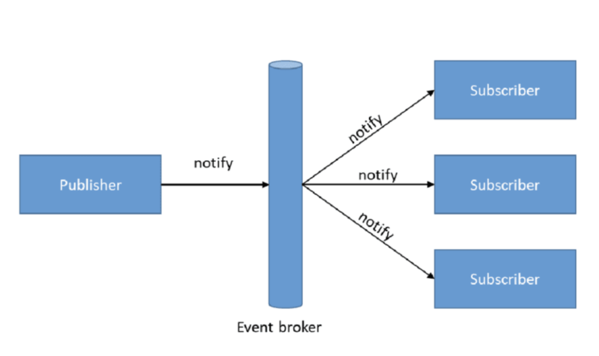
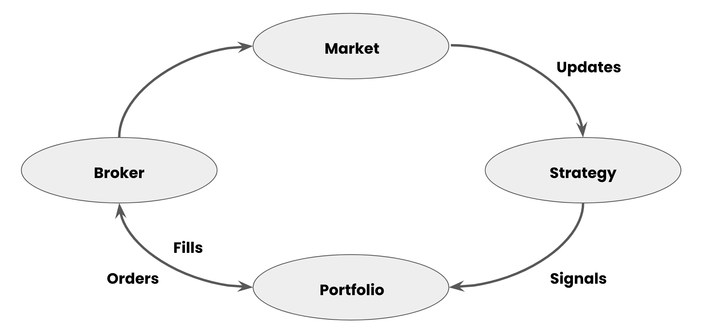
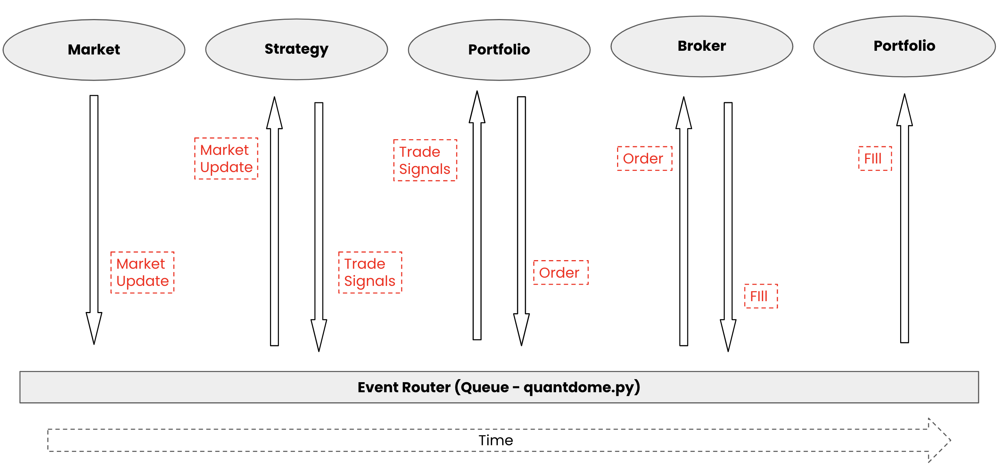

# System Architecture Overview

This document outlines a brief overview of the quantdome architecture design.  Quantdome is an event-driven backtesting (and soon to be live testing) system for automated trading strategies.

## Event Driven Architecture

To most accurately simulate market conditions, quantdome's system is event-driven.  This architectural pattern structures an application into a collection of small, loosely coupled services that work together towards a common goal.  These microservices work independently and can be added or removed without interfereing with other aspects of the overall system.

Microservices can be broken down into three types:
1. **Producers** - these emit events
2. **Consumers** - these consume events
3. **Routers** - these direct events from producers to consumers.

Producers/consumers can be linked to external services such as API endpoints, databases, or in our case, market feeds and brokers. 

### Replicating Market Structure

With EDA (event driven architecture) in mind, we can simplify the market down to a few high level microservices.

Here we see four services:
1. **Market** - this can be viewed as the outside world.  Here we get updates from stocks or signals we are tracking
2. **Strategy** - this is the core of our trading logic.  Here we recieve market updates and generate trade signals based on our logic.
3. **Portfolio** - this is the manager of our trading system.  This maintains portfolio state (i.e. positions, cash, etc.).
4. **Broker** - this is our connection to the market.  We send orders here and recieve fills appropriately.

### Turning this into a Trading Application

Now you hopefully see the breakdown of microservices and events.  If we treat each of the four above modules as its own separate microservice.  We can easily turn this into an EDA based system.

The above images shows our trading cycle layed out linearly with each microservice and their corresponding events.  In its most simple form, `quantdome.py` routes events from each producer to the proper consumer. 

Each microservice is treated as it's own object in python for which it can interact with other objects.  Here's a simple mapping of where each object can be found:
1. market - `quantdome/data.py`
2. strategy - `quantdome/strategy.py` (template)
3. portfolio - `quantdome/portfolio.py`
4. broker - `quantdome/execution.py`